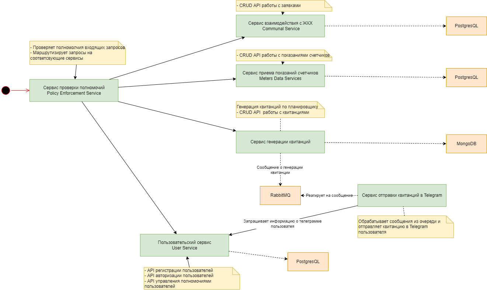

<header>Система управления умным домом "SmartHome"</header>
Система состоит из нескольких микросервисов, одним из которых является сервис приёма показаний счетчиков. Его разработка уже начата.
Для запуска микросервиса нужно прописать в терминале несколько команд:

pip install fastapi

pip install uvicorn

Для установки в виртуальное окружение фреймворка FastAPI и веб-сервера Uvicorn, соответственно.

Далее, с помощью команды cd нужно провалиться к файлу counters.py, чтобы начать работать с ним.

Далее, нужно прописать команду uvicorn counters:app --reload, эта команда запустит сервер.

Перейти в браузере по предложенному в терминале адресу, через слэш приписав docs

Этот (counters.py) файл предназначен для передачи на сервер данных со счётчиков за воду, газ, электроэнергию и отопление. 

Валидация данных происходит автоматически.

Данный микросервис только начал разрабатываться, и в дальнейшем будет доведён до ума, обещаю!

